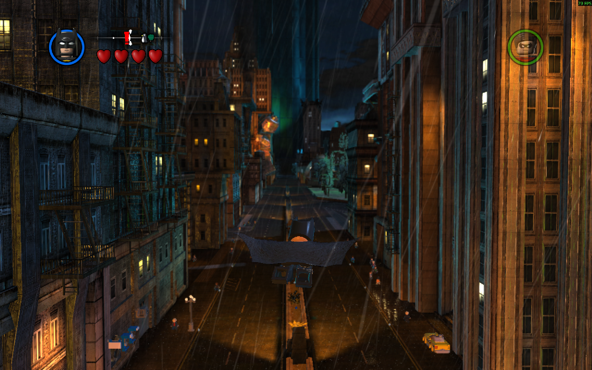
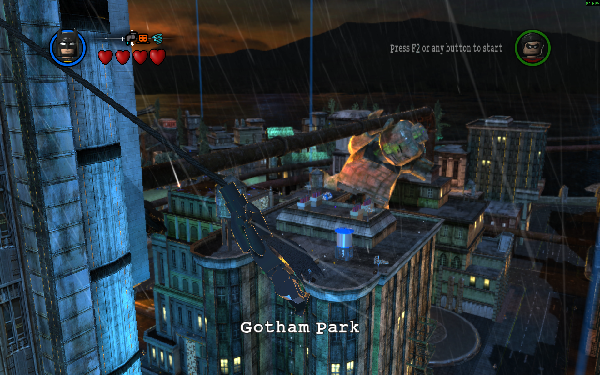

# LegoArkham2

An Arkham-style gameplay mod for the Steam release of LEGO Batman 2: DC Super Heroes.





## Features

- Third person camera
- Borderless windowed mode
- Arkham-style keyboard and mouse controls
- Mouse hook for batarang reticle
- Skippable cutscenes
- Arkham-style gliding for Batman, Robin and Batgirl
- Grapple onto the top edge of most structures
- Most characters can now climb any wall or ceiling
- Flash can now run on most surfaces, including walls
- Sensitivity settings in options
- And much more
  
Most features can be configured via `LegoArkham2.ini`.

## Install

Copy the contents of the release into the game folder (`steamapps\common\LEGO Batman 2`).

## Build

Requires 32-bit MSVC and CMake 3.20 or newer.

```
cmake -S . -B build -A Win32
cmake --build build --config Release
```

